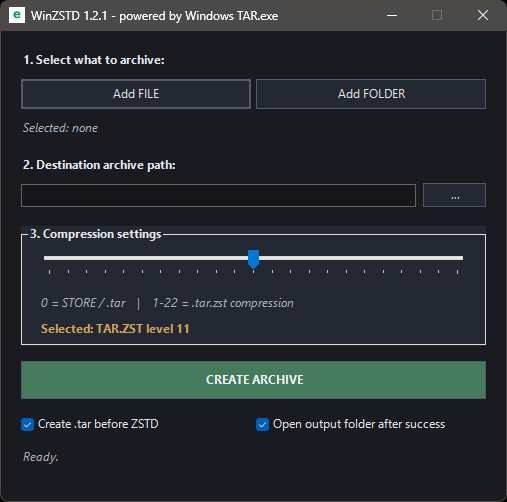

# WinZSTD

**WinZSTD 1.2.1** is a lightweight native Windows GUI for creating `.tar`, `.tar.zst` and `.zst` archives using the built-in Windows `tar.exe`.

No external binaries.  
No bundled tools.  
No 7-Zip dependency.  
Just Windows PowerShell, WinForms and Windows TAR.

---

## About

WinZSTD is a small GUI layer over native Windows `tar.exe`.

It is designed for users who want a simple way to create TAR/ZSTD archives without using command line tools or configuring archive options through Explorer menus.

The goal is simple:

```text
Select input → choose compression level → create archive
```

---

## Features

- Native Windows PowerShell / WinForms GUI
- Uses built-in Windows `tar.exe`
- Creates `.tar` archives
- Creates `.tar.zst` archives
- Creates direct `.zst` files for single files
- Compression level slider from `0` to `22`
- Level `0` = STORE / `.tar`
- Levels `1–22` = ZSTD compression
- Optional `Create .tar before ZSTD`
- TAR is automatically enforced for folders
- Bottom progress bar during archive creation
- Optional output folder opening after successful creation
- No external compression binaries required

---

## Screenshot



---

## Download

Latest release:

https://github.com/eco-by-different/winzstd/releases/latest

Direct EXE download:

https://github.com/eco-by-different/winzstd/releases/latest/download/WinZSTD.exe

Source code:

WinZSTD.ps1

---

## Requirements

- Windows 10 or Windows 11
- Built-in Windows `tar.exe`
- Windows PowerShell 5.1
- WinForms support available in Windows

No installation of Zstandard, 7-Zip, PeaZip or other archiving tools is required.

---

## Usage

1. Run `WinZSTD.exe` or `WinZSTD.ps1`
2. Select a file or folder
3. Choose destination archive path
4. Select compression level
5. Click `CREATE ARCHIVE`
6. Wait until the operation finishes

---

## Compression Levels

WinZSTD uses a simple compression timeline:

```text
0 STORE ................................ 22 EXTREME
```

Recommended reference points:

```text
0  = plain .tar archive
1  = fastest ZSTD compression
11 = balanced default level
19 = strong practical compression
22 = maximum ZSTD level
```

The highest level is not always the best practical choice.  
For many files, level `19` can be a better balance between compression ratio, speed and resource usage than level `22`.

---

## Version History

### WinZSTD 1.2.0

- Added bottom progress bar during archive creation
- Added compact-clean code formatting
- Improved user feedback during processing
- Kept native Windows `tar.exe` backend
- Kept minimal WinForms interface
- Kept zero external binary dependency

### WinZSTD 1.1.0

- Added compression level timeline from `0` to `22`
- Added default compression level `11`
- Added optional `Create .tar before ZSTD` mode
- Added direct `.zst` mode for single files
- Folder input automatically enforces TAR container
- Improved GUI layout

### WinZSTD 1.0.0

- Initial public release
- Added basic `STORE`, `NORMAL` and `EXTREME` profiles
- Added native Windows TAR/ZSTD GUI powered by Windows `tar.exe`

---

## Philosophy

**eco-by-different**

Maximize efficiency.  
Minimize waste.  
Keep it practical.

WinZSTD follows this idea by using native Windows components and avoiding unnecessary bundled tools.

---

## License

MIT License

Copyright (c) 2026 Jan Simak

Permission is hereby granted, free of charge, to any person obtaining a copy
of this software and associated documentation files (the "Software"), to deal
in the Software without restriction, including without limitation the rights
to use, copy, modify, merge, publish, distribute, sublicense, and/or sell
copies of the Software, and to permit persons to whom the Software is
furnished to do so, subject to the following conditions:

The above copyright notice and this permission notice shall be included in all
copies or substantial portions of the Software.

THE SOFTWARE IS PROVIDED "AS IS", WITHOUT WARRANTY OF ANY KIND, EXPRESS OR
IMPLIED, INCLUDING BUT NOT LIMITED TO THE WARRANTIES OF MERCHANTABILITY,
FITNESS FOR A PARTICULAR PURPOSE AND NONINFRINGEMENT. IN NO EVENT SHALL THE
AUTHORS OR COPYRIGHT HOLDERS BE LIABLE FOR ANY CLAIM, DAMAGES OR OTHER
LIABILITY, WHETHER IN AN ACTION OF CONTRACT, TORT OR OTHERWISE, ARISING FROM,
OUT OF OR IN CONNECTION WITH THE SOFTWARE OR THE USE OR OTHER DEALINGS IN THE
SOFTWARE.
